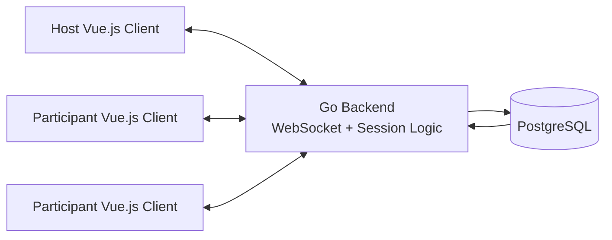
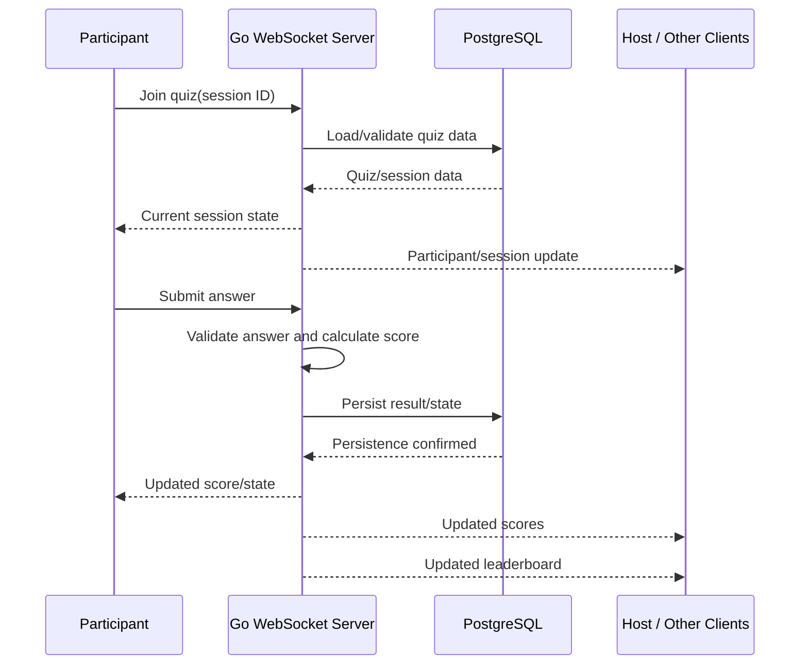

# System Design Document — Real-Time Vocabulary Quiz

## 1. Overview

The Real-Time Vocabulary Quiz is a live English-learning quiz experience in which multiple participants join the same quiz session, submit answers, receive updated scores, and see the current leaderboard without manually refreshing the page.

The design focuses on the three core acceptance criteria from the challenge:

1. **User Participation** — participants join using a unique quiz ID and multiple users can participate in the same session.
2. **Real-Time Score Updates** — scores are calculated consistently and reflected as answers are submitted.
3. **Real-Time Leaderboard** — the current standings are updated and delivered to connected participants promptly.

The implementation is intentionally focused on the core real-time experience rather than attempting to build a complete production quiz platform.

## 2. Solution Approach

The product flow was established before implementation of the final application.

The development process was:

1. **Product-flow prototype** — an HTML prototype was used to clarify the host and participant experience and settle the main interaction flow before committing to the application structure.
2. **Frontend implementation** — the approved prototype flow was converted into a Vue.js application.
3. **Real-time backend** — the core backend was developed in Go, with WebSocket used for live communication between the server and connected clients.
4. **Persistence** — PostgreSQL provides durable storage for quiz/session-related data and results.
5. **Development environment** — Podman provides a reproducible container-based environment, while Make provides repeatable development and test commands.

This sequence kept product decisions separate from implementation details and allowed the real-time behavior to be developed around an already-understood user flow.

## 3. Requirements and Design Response

| Challenge requirement | Design response |
|---|---|
| Join with a unique quiz ID | The participant uses a quiz/session identifier to join the corresponding live session. |
| Multiple users simultaneously | The Go server maintains a live session with multiple connected clients. |
| Real-time scoring | Answers are processed by the server and the resulting score is propagated to connected clients. |
| Real-time leaderboard | The server maintains the current standings and broadcasts updated leaderboard information when scores change. |
| Accurate and consistent scoring | Scoring is handled on the server rather than trusting calculations performed independently by each client. |
| AI collaboration | AI tools were used during product exploration, frontend conversion, backend development, debugging, and refinement, with human verification throughout the implementation process. |

## 4. High-Level Architecture



The Go backend is the central real-time component. Host and participant clients connect to it through WebSocket connections. The backend manages the live session, processes answers, calculates scores, and distributes the resulting state to connected clients. PostgreSQL provides persistence outside the live connection layer.

For the challenge implementation, the **Go real-time backend is the primary core component**. The Vue clients provide the working interface used to demonstrate the behavior.

## 5. Component Responsibilities

### 5.1 Vue.js Host Client

The host interface provides the session control and live-session view needed to observe the quiz while participants are connected.

Responsibilities:

- Connect to the live quiz session.
- Show current session state.
- Show participant activity.
- Display scores and leaderboard information received from the server.
- Provide the host-facing view of the running quiz.

The client is responsible for presentation and interaction, not authoritative scoring.

### 5.2 Vue.js Participant Client

The participant interface provides the user-facing quiz experience.

Responsibilities:

- Join a quiz using its quiz/session identifier.
- Receive quiz/session state from the server.
- Present questions and answer choices.
- Send submitted answers to the backend.
- Render score and leaderboard updates received over the real-time connection.

### 5.3 Go Real-Time Backend

The Go backend is the core implemented real-time component.

Responsibilities:

- Accept WebSocket connections.
- Associate connections with the appropriate quiz session.
- Maintain active participants for a session.
- Receive answer submissions.
- Validate and process answers.
- Calculate score changes.
- Maintain current leaderboard state.
- Broadcast relevant updates to connected clients.
- Coordinate persistence with PostgreSQL.

Keeping these responsibilities on the server provides one authoritative source for the live session state.

### 5.4 WebSocket Layer

WebSocket provides the persistent communication channel between browser and backend.

Instead of requiring clients to repeatedly poll the server for changes, the server can push updates as soon as meaningful state changes occur.

This is useful for:

- Participant joins.
- Answer submissions.
- Score changes.
- Leaderboard changes.
- Other live session state changes.

### 5.5 PostgreSQL

PostgreSQL provides durable storage for quiz and result data.

The database is separated from transient WebSocket connection state so live connections and durable application data have different responsibilities.

### 5.6 Podman and Make

Podman keeps the development/runtime environment consistent across machines.

Make provides a simple interface for repeatable project commands such as starting services, running tests, and other development tasks.

## 6. Real-Time Data Flow

The core flow is:

```text
Participant
    |
    | 1. Join with quiz ID
    v
Go WebSocket Server
    |
    | 2. Validate/load session
    v
Quiz Session State
    |
    | 3. Send current state
    v
Participant

Participant
    |
    | 4. Submit answer
    v
Go WebSocket Server
    |
    | 5. Validate + calculate score
    v
Session / Leaderboard State
    |
    +------> PostgreSQL
    |
    | 6. Broadcast updated state
    +------> Participant clients
    |
    +------> Host client
```

### 6.1 Joining a Quiz

1. A participant opens the quiz experience.
2. The participant provides the unique quiz/session identifier.
3. The Vue client establishes a WebSocket connection with the Go backend.
4. The backend associates the connection with the requested session.
5. The participant receives the current session state.
6. Existing session participants can receive the corresponding participant-state update.

### 6.2 Submitting an Answer

1. The participant selects an answer.
2. The Vue client sends the answer through the WebSocket connection.
3. The Go backend validates and processes the submission.
4. The backend calculates the resulting score according to the quiz scoring rules.
5. The current session/leaderboard state is updated.
6. The resulting state is sent to the relevant connected clients.
7. The UI updates without requiring a page refresh.

### 6.3 Updating the Leaderboard

The leaderboard is derived from server-side session state and updated when participant scores change.

The important design decision is that clients do not independently decide the authoritative ranking. They receive the current result from the server and render it.

## 7. Real-Time Interaction Sequence



The sequence highlights the main real-time loop required by the challenge: **join → answer → score → leaderboard update**.

## 8. Server-Authoritative Session Model

The backend acts as the authority for the live quiz state.

At a high level, a live session contains:

- Quiz/session identity.
- Connected participants.
- Current quiz state.
- Participant answer results.
- Participant scores.
- Current leaderboard information.

The browser maintains UI state for rendering, but the authoritative score and leaderboard are produced by the backend.

This separation is important because a real-time competitive experience should not depend on every client independently reaching the same scoring result.

## 9. Technology Choices

### Vue.js

Vue.js fits the interactive participant and host interfaces. Its reactive UI model makes it straightforward to update the screen when new session, score, or leaderboard data arrives.

### Go

Go was selected for the backend because the core problem is a focused real-time service with concurrent client connections and straightforward server-side state management. It keeps the backend implementation compact while providing a good foundation for handling multiple WebSocket connections.

### WebSocket

WebSocket was chosen because the application needs server-to-client updates while a quiz is running. A persistent connection avoids repeatedly polling the server for score and leaderboard changes.

### PostgreSQL

PostgreSQL provides reliable relational persistence for quiz and result data. It is a practical choice for an application that needs durable records in addition to transient live-session state.

### Podman

Podman provides a consistent container-based environment for running application dependencies and reduces differences between development environments.

### Make

Make provides a small, predictable command layer around common development workflows, keeping setup and repeated project commands easy to discover and execute.

## 10. Implemented Scope

The challenge asks for one core real-time component to be implemented while surrounding parts can be mocked or kept lightweight.

For this submission, the **Go real-time backend is the primary implemented component**.

The demonstrated flow covers:

- Joining a quiz/session.
- Multiple participants connected to the same live session.
- Receiving answer submissions.
- Server-side score processing.
- Live score updates.
- Live leaderboard updates.
- Vue.js clients consuming those updates.
- PostgreSQL as the persistence layer.

The host and participant interfaces support the demonstration of this component rather than attempting to represent every feature that a complete commercial quiz platform might eventually need.

## 11. Scalability Considerations

The current architecture is intentionally simple and suitable for the challenge. A single Go service can own active session state and coordinate connected WebSocket clients.

If the application grows to multiple backend instances, the main architectural change would be shared live-session state.

A production-scale version could introduce:

- A shared session/state or pub/sub layer between backend instances.
- Load balancing for WebSocket connections.
- Appropriate connection-routing or session-affinity strategies.
- Database indexing and connection pooling as data volume increases.
- Separation of high-volume real-time events from durable persistence when necessary.

The important scalability boundary is that live session state cannot remain isolated inside one server once the same quiz session can be distributed across multiple backend instances.

## 12. Performance Considerations

The design avoids periodic polling for the core live experience.

Performance considerations include:

- Persistent WebSocket connections instead of repeated polling.
- Server-side handling of active session state.
- Keeping database operations focused on durable data rather than using the database as the transport mechanism for every UI update.
- Broadcasting only the state required by connected clients.
- Avoiding unnecessary client-side recalculation of scores and rankings.

For a production deployment, useful measurements would include:

- Answer-processing latency.
- WebSocket message latency.
- Number of active connections.
- Messages sent per session.
- Database query latency.
- Error and disconnect rates.

## 13. Reliability Considerations

The server-authoritative model provides a clear source of truth for scoring and leaderboard state.

Important reliability cases for a production version include:

- Invalid submissions.
- Duplicate submissions.
- Client disconnects.
- Temporary network interruptions.
- Reconnecting clients.
- Persistence failures.
- Unexpected server termination.

A reconnecting participant should be able to recover the current session state rather than depending only on events that happened while the connection was unavailable.

The challenge implementation prioritizes the core real-time path; more advanced recovery and distributed-failure handling are future production concerns.

## 14. Maintainability

The system is organized around clear responsibilities:

```text
Vue UI
   ↓
WebSocket communication
   ↓
Go session / scoring logic
   ↓
Persistence
   ↓
PostgreSQL
```

This separation helps keep UI concerns out of scoring logic and keeps persistence concerns out of the presentation layer.

As the product grows, maintainability priorities would be:

- Keeping session and scoring rules isolated from transport code.
- Keeping database access isolated from business logic.
- Using clear message/state structures between client and server.
- Adding automated tests around scoring and session behavior.
- Keeping infrastructure commands reproducible through Make/Podman.

## 15. Monitoring and Observability

The challenge asks for consideration of monitoring and observability as the system evolves.

A production deployment should provide visibility into:

- Active WebSocket connections.
- Active quiz sessions.
- Participants per session.
- Answer-processing latency.
- WebSocket errors/disconnects.
- Score-processing failures.
- Database errors and latency.
- Unexpected session termination.

Structured server logs would provide the basic foundation. Metrics and dashboards could then be added for operational monitoring.

The goal is to distinguish a UI problem from a WebSocket problem, backend processing problem, or database problem without relying only on user reports.

## 16. AI Collaboration in the Design Process

AI collaboration was part of the development process rather than a final documentation step.

The workflow began with ChatGPT-assisted product exploration and an HTML prototype. This was used to clarify the quiz flow before implementation.

The HTML prototype was then converted into the Vue.js application using Antigravity.

The backend was developed iteratively using a combination of:

- Antigravity
- OpenCode
- GitHub Copilot
- Devin

These tools were used in an iterative and sometimes circular workflow. Different tools were used to generate, inspect, modify, debug, and refine parts of the implementation, including because free-tier limits affected which tool was available at a particular point.

AI-generated or AI-assisted code was not treated as automatically correct. The resulting implementation was reviewed, run, tested, debugged, and refined against the expected application behavior.

A detailed account of the tools, representative interactions, verification process, limitations, and lessons learned is provided separately in `AI_COLLABORATION.md`.

## 17. Testing and Verification

Verification focused on the behavior required by the challenge rather than only checking that individual functions compile.

### Participation

- A participant can join using a quiz ID.
- More than one participant can join the same session.
- Connected participants receive the appropriate session state.

### Scoring

- An answer submission reaches the server.
- The server determines the scoring result.
- The participant's score changes consistently with the server-side result.

### Leaderboard

- A score change causes the current leaderboard to be updated.
- Connected clients receive the updated leaderboard.
- The displayed ordering reflects current server-side scores.

### End-to-End Real-Time Behavior

```text
Join
  ↓
Connect
  ↓
Answer
  ↓
Server processes answer
  ↓
Score changes
  ↓
Leaderboard changes
  ↓
Connected UI updates
```

This end-to-end behavior is the main verification target because it directly maps to the challenge acceptance criteria.

## 18. Trade-offs and Future Improvements

The implementation intentionally favors clarity and a working real-time path over a large production architecture.

### Current trade-offs

- A relatively simple backend topology is used instead of distributed real-time infrastructure.
- The challenge focuses on the core live quiz flow rather than authentication, advanced analytics, or enterprise operations.
- The database is used for durable application data while the active real-time experience is managed by the backend.
- Production-grade distributed recovery and observability can be expanded later.

### Natural next steps

1. More comprehensive automated tests for session and scoring edge cases.
2. Robust reconnect and recovery behavior.
3. Shared real-time state/pub-sub for multiple backend instances.
4. Production metrics, tracing, and alerting.
5. Stronger validation and abuse protection around live sessions.
6. More detailed session and quiz analytics.

These improvements can be added without changing the central architecture: **clients connect to a server-authoritative real-time quiz session, the server processes answers and scores, and the resulting state is pushed to connected clients.**

## 19. Summary

The system uses Vue.js clients, a Go WebSocket backend, and PostgreSQL to provide the core real-time vocabulary quiz experience.

The architecture directly addresses the challenge's three acceptance criteria:

- Participants join a shared quiz session using a quiz identifier.
- Answers are processed centrally and scores are updated in real time.
- The current leaderboard is updated and delivered to connected clients.

The design also identifies how the system can evolve in scalability, performance, reliability, maintainability, and observability without adding unnecessary infrastructure to the challenge implementation.

AI tools were used throughout the product and engineering workflow, from the initial HTML prototype through frontend conversion and backend implementation. The important part of that collaboration was not simply generating code, but repeatedly reviewing, running, testing, debugging, and refining AI-assisted output against the intended product behavior.
